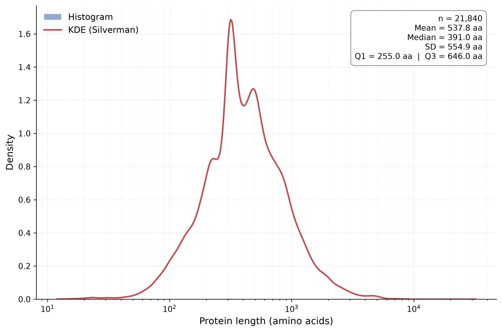

# The Mouse Proteome in Numbers: A Distributional Analysis of Protein Lengths in *Mus musculus* (STRINGdb v12.0)

**Project type:** Computational proteomics / genome-scale descriptive analysis  
**Organism:** *Mus musculus* (house mouse, NCBI Taxonomy ID 10090)  
**Data source:** STRING database, release 12.0  
**Environment:** Conda environment `bio_project` (Python 3.12, numpy, pandas, matplotlib)

---

## 1. Research Background

Protein length is a first-order structural and functional feature of every proteome. It constrains folding energetics, caps the size of globular domains, correlates with the number and complexity of functional modules a protein can carry, and varies systematically across functional categories — signaling and structural scaffold proteins are typically large, whereas regulatory peptides and small effectors are short. At the genome scale, the distribution of protein lengths therefore encodes information about the evolutionary history, domain architecture, and functional organization of the proteome.

The laboratory mouse (*Mus musculus*) is the principal mammalian model organism in biomedical research, and a well-annotated census of its proteome provides a reference point for comparative, evolutionary, and disease-focused studies. This project performs a reproducible, distributional analysis of *M. musculus* protein lengths using the STRING database (release 12.0), a widely used integrated resource that aggregates protein-coding information across orthologous genomes.

### 1.1 Research Objectives

1. **Curate** the complete set of annotated *M. musculus* proteins reported by STRING v12.0, filtering unannotated or malformed size entries.
2. **Quantify** the central tendency, dispersion, and quartile structure of protein lengths (mean, median, standard deviation, quartiles, min/max).
3. **Characterize** the shape of the length distribution (skewness, heavy tail) via a publication-grade histogram with kernel density estimate (KDE).
4. **Highlight** the largest proteins in the proteome and interpret their biological significance.
5. **Document** a step-by-step, Conda-based reproducibility protocol.

---

## 2. Dataset Provenance

| Attribute | Value |
|---|---|
| **Database** | STRING (Search Tool for the Retrieval of Interacting Genes/Proteins) |
| **Release** | v12.0 (2023) |
| **Organism** | *Mus musculus* (house mouse) |
| **NCBI Taxonomy ID** | 10090 |
| **Input file** | `data/10090.protein.info.v12.0.txt.gz` |
| **File format** | Tab-separated values (TSV), gzip-compressed, UTF-8 |
| **Source URL** | https://string-db.org (download portal: `https://string-db.org/cgi/download`) |
| **Records** | 21,840 protein entries |
| **License / citation** | Academic use; cite Szklarczyk et al., Nucleic Acids Research, 2023 (see [References](#11-references)) |

### 2.1 Data Schema

| Column | Type | Description | Example |
|---|---|---|---|
| `#string_protein_id` | `string` | STRING protein identifier (species prefix + Ensembl protein ID) | `10090.ENSMUSP00000000001` |
| `preferred_name` | `string` | Primary gene/protein symbol | `Gnai3` |
| `protein_size` | `integer` | Protein length in amino acids (aa) | `354` |
| `annotation` | `string` | Functional annotation summary (UniProt-derived) | `Guanine nucleotide-binding protein G(i) subunit alpha; ...` |

> **Data-quality note.** The `protein_size` column is the sole analytical input. Entries that are non-numeric, missing, or `≤ 0` ("unannotated sizes") are filtered prior to analysis. In the present release all 21,840 records carry an annotated, positive size.

---

## 3. Methods and Analysis Pipeline

All processing is implemented in Python and executed inside the Conda environment `bio_project`. The pipeline is fully deterministic and documented in two scripts:

| Script | Role | Dependencies |
|---|---|---|
| [`scripts/analyze_lengths.py`](scripts/analyze_lengths.py) | Parses the gzipped TSV; computes count, min/max/mean; reports the top-5 largest proteins; writes `results/protein_length_stats.json` | Standard library only |
| [`scripts/plot_protein_distribution.py`](scripts/plot_protein_distribution.py) | Filters unannotated sizes; computes mean, median, std dev, quartiles; renders the histogram + KDE figure; writes `results/protein_length_distribution.png` | numpy, pandas, matplotlib |

**Pipeline steps:**

1. **Loading.** The gzipped TSV is decompressed on the fly and read with `pandas.read_csv(sep="\t")`; the `protein_size` column is extracted.
2. **Filtering.** Sizes are coerced to numeric; `NaN`, empty, and non-positive values are discarded as unannotated.
3. **Statistics.** Mean, median, standard deviation (sample, *n* − 1), and the 25th/50th/75th percentiles are computed with numpy.
4. **Visualization.** The length distribution is rendered as a histogram with 80 logarithmically spaced bins overlaid with a Gaussian KDE. Because protein lengths are strongly right-skewed (range 12–32,000 aa), the x-axis is log-scaled so that the bulk of the distribution is resolved. The KDE uses Silverman's rule-of-thumb bandwidth and is implemented in pure numpy — **no scipy dependency is required**. The figure is exported at 300 dpi with publication styling (clean spines, dotted grid, statistics annotation box).

---

## 4. Results: Descriptive Statistics

Analysis of **21,840 annotated** *M. musculus* proteins (filtered set equal to the full release in v12.0).

| Metric | Value |
|---|---:|
| **Total proteins** | 21,840 |
| **Min length** | 12 aa |
| **Max length** | 32,000 aa |
| **Mean length** | 537.8 aa |
| **Median length** | 391.0 aa |
| **Standard deviation** | 554.9 aa |
| **Q1 (25th percentile)** | 255.0 aa |
| **Q3 (75th percentile)** | 646.0 aa |

**Key observations.**

- The **median (391 aa) is well below the mean (537.8 aa)**, and Q1–Q3 span only 255–646 aa, while the maximum reaches 32,000 aa — a hallmark of a strongly right-skewed (approximately log-normal) length distribution.
- **~75% of mouse proteins are ≤ 646 aa**; the majority of the proteome consists of single- or few-domain proteins.
- The **standard deviation (554.9 aa) exceeds the median**, confirming substantial dispersion driven by the heavy right tail of very large scaffold proteins.

---

## 5. Results: Top 5 Largest Proteins of the Mouse Proteome

The five largest proteins are all giant, multi-modular proteins whose biological roles depend on their extreme size — in every case, length *is* function: physically spanning cytoskeletal or sarcomeric structures.

| Rank | Protein ID | Name | Length (aa) |
|---:|---|---|---:|
| 1 | `10090.ENSMUSP00000107477` | **Ttn** (Titin) | 32,000 |
| 2 | `10090.ENSMUSP00000147104` | **Muc16** (Mucin 16) | 8,478 |
| 3 | `10090.ENSMUSP00000038264` | **Obscn** (Obscurin) | 8,032 |
| 4 | `10090.ENSMUSP00000138308` | **Dst** (Dystonin) | 7,717 |
| 5 | `10090.ENSMUSP00000095507` | **Macf1** (Microtubule-actin cross-linking factor 1) | 7,355 |

### 5.1 Biological context

**1. Titin (Ttn) — 32,000 aa.** Titin is the largest known protein in mammals (~3–3.7 MDa) and dwarfs every other entry in the mouse proteome by nearly 4× (32,000 vs. 8,478 aa). It is the third myofilament of the striated-muscle sarcomere, spanning half a sarcomere from the Z-disc to the M-line. Its sequence is an array of hundreds of immunoglobulin (Ig)-like and fibronectin type III (Fn3) domains organized into super-repeats, interrupted by the intrinsically disordered, proline-glutamate-valine-lysine-rich **PEVK segment** and an N2A region. This modular architecture endows titin with spring-like elasticity: it generates **passive tension** that scales with sarcomere stretch and determines the extensibility of the sarcomere (see dataset annotation: *"The size and extensibility of the cross-links are the main determinants of sarcomere extensibility properties of muscle"*). Titin also carries a single catalytic **serine/threonine kinase domain** at its C-terminus, and germline truncating variants are a well-established cause of **dilated cardiomyopathy** (and other myopathies). Beyond muscle, titin has reported roles in chromosome condensation and segregation during mitosis. Its dominance of the length distribution (a 3.8× gap to the runner-up) makes it the archetypal "giant protein."

**2. Mucin 16 (Muc16) — 8,478 aa.** A large, heavily *O*-glycosylated transmembrane mucin with an extended tandem-repeat ectodomain. It forms a protective, gel-like barrier on epithelial surfaces (e.g., the ocular surface and peritoneum) and lubricates mucosal membranes. The shed ectodomain is the well-known **CA-125 (cancer antigen 125)** — the most widely used serum biomarker for ovarian cancer — and the protein has been implicated in tumor immune evasion and metastatic progression. Its enormous length is generated by hundreds of tandem glycosylation repeats rather than folded domains.

**3. Obscurin (Obscn) — 8,032 aa.** A giant modular sarcomeric protein of striated muscle, built from ~50 Ig/Fn3 domains plus a pleckstrin-homology (PH) domain and a C-terminal Ser/Thr kinase domain. Obscurin participates in **myofibrillogenesis** and the incorporation of myosin into sarcomeric A-bands; it binds titin at the Z-I junction and phosphoinositides via its PH domain, and links the sarcomere to the surrounding sarcoplasmic reticulum, thereby integrating the contractile apparatus with cellular signaling.

**4. Dystonin (Dst) — 7,717 aa.** A member of the spectraplakin family and a "broad-spectrum" cytoskeletal cross-linker: it integrates the **intermediate-filament, actin, and microtubule** networks. Dystonin anchors intermediate filaments to actin in neuronal and muscle cells, keratin filaments to hemidesmosomes in epithelia, and stabilizes the microtubule network of sensory neurons to sustain axonal transport. Mutations underlie the neurological disorder *dystonia musculorum* in mice and hereditary sensory neuropathies in humans.

**5. MACF1 — 7,355 aa.** The Microtubule-Actin Cross-linking Factor 1 (a spectraplakin) cross-links F-actin to microtubules at the cell cortex, stabilizes cortical microtubules in an ErbB2-dependent manner, and positively regulates **Wnt/β-catenin signaling** by escorting the Axin destruction complex to the membrane. Its actin-regulated ATPase activity is essential for focal adhesion dynamics, cell polarization, and migration — coordinating the two principal cytoskeletal networks during development and wound healing.

> **Takeaway.** Ranks 1, 3, 4, and 5 are all giant *cytoskeletal / sarcomeric scaffolding proteins* whose mechanical and signaling functions require them to physically span micron-scale cellular structures; rank 2 is a giant *glycosylated surface mucin*. Their outsized lengths are functional necessities, not biological noise.

---

## 6. Results: Protein Length Distribution



**Figure 1.** Distribution of annotated protein lengths across the *M. musculus* proteome (n = 21,840). Histogram (80 log-spaced bins, density-normalized) with Gaussian KDE overlay (Silverman bandwidth). The x-axis is log-scaled to resolve the strongly right-skewed data; the inset box reports mean, median, standard deviation, and interquartile range.

**Interpretation of the figure.**

- The distribution is **unimodal and right-skewed**, peaking in the ~200–400 aa range and decaying smoothly toward large sizes — the classic shape of an approximately log-normal length distribution.
- **No secondary mode** is evident in the tail: giant proteins (> 5,000 aa) are present by design (cytoskeletal and sarcomeric scaffolds) but represent a tiny fraction of the proteome.
- The **log-scale presentation** makes the ~24× fold difference between the median and the titin outlier visible in a single panel; on a linear axis, 99% of the data would be compressed into a narrow sliver below 2,000 aa.

---

## 7. Discussion

The quantile structure of the mouse proteome — median 391 aa, Q1/Q3 = 255/646 aa — aligns with the expectation that most proteins are single-domain or small multi-domain polypeptides, and that protein length is geometrically (multiplicatively) constrained during evolution. The heavy right tail is populated not by pathological artifacts but by a functionally coherent class of **giant scaffolding proteins** (titin, obscurin, dystonin, MACF1, mucins), for which extended structure is the mechanism of action. The mouse distribution is characteristic of mammalian proteomes and offers a natural baseline for comparisons against the human proteome, other vertebrate lineages, and disease-associated length-altering variants (e.g., titin truncations in cardiomyopathy).

---

## 8. Reproducibility Guide (Conda environment `bio_project`)

The entire analysis is reproducible in a clean environment in under two minutes. All commands assume a POSIX shell and a working Conda/Miniconda installation.

### Step 1 — Verify Conda

```bash
conda --version
```

If Conda is not installed, install Miniconda first: https://docs.conda.io/en/latest/miniconda.html

### Step 2 — Create (or verify) the `bio_project` environment

The analysis requires **Python ≥ 3.10** with `numpy`, `pandas`, and `matplotlib`. Create the environment if it does not exist:

```bash
conda create -n bio_project python=3.12 numpy pandas matplotlib -y
```

> **Note.** If the environment already exists (e.g., `bio_project` is present in `conda env list`), skip creation and simply activate it. The exact versions used in this analysis were Python 3.12.14, numpy 2.5.2, pandas 3.0.5, and matplotlib 3.11.0. No scipy or seaborn is required — the KDE is implemented in pure numpy.

### Step 3 — Clone / obtain the repository and data

```bash
git clone <repository-url> project-practice
cd project-practice
```

Confirm the raw data is present:

```bash
ls -lh data/10090.protein.info.v12.0.txt.gz
```

If absent, download it from the STRING download portal (`https://string-db.org/cgi/download?taxonomy_id=10090`) and place the file at `data/10090.protein.info.v12.0.txt.gz`.

### Step 4 — Activate the environment

```bash
conda activate bio_project
```

Sanity-check the runtime:

```bash
python -c "import numpy, pandas, matplotlib; print('dependencies OK')"
```

### Step 5 — Run the analysis scripts

**5a. Compute summary statistics + JSON output:**

```bash
python scripts/analyze_lengths.py
```

**5b. Generate the visualization:**

```bash
python scripts/plot_protein_distribution.py
```

Both scripts are headless-safe (matplotlib uses the `Agg` backend) and complete in seconds. The plot script prints the full descriptive statistics to the console.

### Step 6 — Verify the outputs

| Expected artifact | Location | Description |
|---|---|---|
| Console statistics | stdout | Mean, median, SD, Q1, Q3, n |
| Summary statistics (JSON) | `results/protein_length_stats.json` | Machine-readable count, min/max/mean, top-5 proteins |
| Publication figure (PNG) | `results/protein_length_distribution.png` | 300-dpi histogram + KDE (2670 × 1770 px) |
| Text summary (legacy) | `results/size_summary.txt` | Count, min/max/mean/median |

```bash
ls -lh results/
```

You should see `protein_length_stats.json` and `protein_length_distribution.png`. A typical successful run reports:

```
Annotated sizes : 21,840
Mean            : 537.8 aa
Median          : 391.0 aa
Standard dev.   : 554.9 aa
Q1 (25%)        : 255.0 aa
Q3 (75%)        : 646.0 aa
Plot saved to   : results/protein_length_distribution.png
```

### Troubleshooting

| Problem | Fix |
|---|---|
| `ModuleNotFoundError: numpy/pandas/matplotlib` | Environment not activated → `conda activate bio_project`; if it persists, re-run `conda install -n bio_project numpy pandas matplotlib` |
| `FileNotFoundError: data/10090.protein.info.v12.0.txt.gz` | Run scripts from the repository root (`project-practice/`); re-download the data file |
| `conda: command not found` | Conda not on PATH → install Miniconda or run `source ~/miniconda3/etc/profile.d/conda.sh` |
| Figure renders with compressed bars | Expected on a linear axis for this skewed data; the script intentionally uses a log-scaled x-axis |

---

## 9. Repository Structure

```
project-practice/
├── data/
│   └── 10090.protein.info.v12.0.txt.gz      # Raw STRING v12.0 input (immutable)
├── scripts/
│   ├── analyze_lengths.py                   # JSON summary + top-5 report
│   ├── plot_protein_distribution.py         # Statistics + histogram/KDE figure
│   ├── extract_info.py                      # Utility: TSV → CSV sample
│   └── parse_proteins.py                    # Utility: record parser
├── results/
│   ├── protein_length_stats.json            # Machine-readable summary
│   ├── protein_length_distribution.png      # Publication figure (300 dpi)
│   ├── size_summary.txt                     # Legacy text summary
│   └── protein_info_sample.csv              # Sample excerpt of the data
└── README.md
```

---

## 10. Data Availability

- **Primary data:** STRING database release 12.0 — `https://string-db.org` (file `10090.protein.info.v12.0.txt.gz`, taxonomy ID 10090).
- **Derived artifacts:** `results/protein_length_stats.json` and `results/protein_length_distribution.png` are regenerated by the scripts and can be reproduced exactly with the protocol in [Section 8](#8-reproducibility-guide-conda-environment-bio_project).

---

## 11. References

1. **Szklarczyk D, Kirsch R, Koutrouli M, et al.** The STRING database in 2023: genes under the control of their regulatory elements. *Nucleic Acids Research*. 2023;51(D1):D670–D676. doi:10.1093/nar/gkac1000
2. **Labeit S, Kolmerer B.** Titins: giant proteins in charge of muscle ultrastructure and elasticity. *Science*. 1995;270(5234):293–296. doi:10.1126/science.270.5234.293
3. **Bang ML, Centner T, Fornoff F, et al.** The complete gene sequence of titin, expression of an unusual ~700-kDa titin isoform, and its interaction with obscurin identify a novel Z-line to I-band linking system. *Circulation Research*. 2001;89(11):1065–1072. doi:10.1161/hh2301.100981
4. **Mouse Genome Sequencing Consortium.** Initial sequencing and comparative analysis of the mouse genome. *Nature*. 2002;420(6915):520–562. doi:10.1038/nature01262

---

*Analyzed with STRINGdb v12.0 · Mus musculus (taxid 10090) · 21,840 proteins · Environment: `bio_project`*